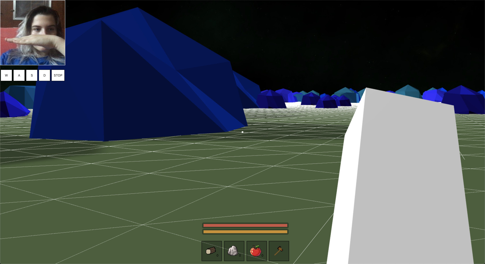

# accessible-space

https://kitzeller.github.io/accessible-space/

### Description

You can define gestures for WASD controls by making a gesture and then clicking the corresponding button. Each time you click the
button it will add a training image to the KNNClassifer for that class. The more images, the more accurate predictions will be. Be sure to train a neutral image
for when you want to stop movement (e.g. a neutral position) 

### Tools

- Tensorflow.js
- Babylon.js
